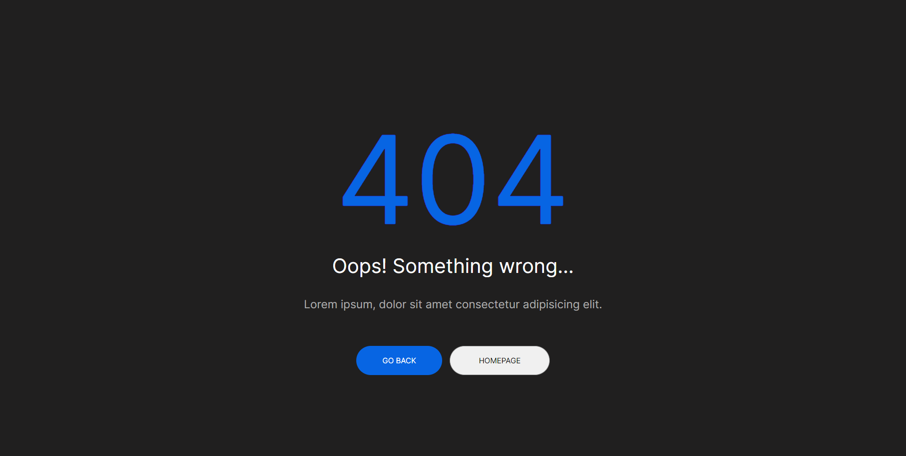

# 404-page
Projeto desenvolvido com base em uma página de 404.

## 🚀 Tecnologias

Esse projeto foi desenvolvido com as seguintes tecnologias:
- HTML
- CSS

## 📚 Bibliotecas:
- [Google Fonts](https://fonts.google.com/)

## 💻 Projeto

[Clique aqui para acessar](https://404-page-hazel.vercel.app/)
> **Objetivo:** Criar uma página de erro 404.
